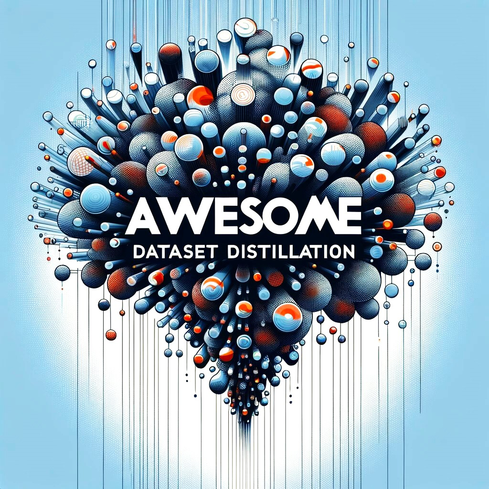

# Awesome Dataset Distillation 

[](https://github.com/sindresorhus/awesome)
   

**Awesome Dataset Distillation** provides the most comprehensive and detailed information on the Dataset Distillation field.

**Dataset distillation** is the task of synthesizing a small dataset such that models trained on it achieve high performance on the original large dataset. A dataset distillation algorithm takes as **input** a large real dataset to be distilled (training set), and **outputs** a small synthetic distilled dataset, which is evaluated via testing models trained on this distilled dataset on a separate real dataset (validation/test set). A good small distilled dataset is not only useful in dataset understanding, but has various applications (e.g., continual learning, privacy, neural architecture search, etc.). This task was first introduced in the paper [*Dataset Distillation* [Tongzhou Wang et al., '18]](https://www.tongzhouwang.info/dataset_distillation/), along with a proposed algorithm using backpropagation through optimization steps. Then the task was first extended to the real-world datasets in the paper [*Medical Dataset Distillation* [Guang Li et al., '19]](https://arxiv.org/abs/2104.02857), which also explored the privacy preservation possibilities of dataset distillation. In the paper [*Dataset Condensation* [Bo Zhao et al., '20]](https://arxiv.org/abs/2006.05929), gradient matching was first introduced and greatly promoted the development of the dataset distillation field.

In recent years (2022-now), dataset distillation has gained increasing attention in the research community, across many institutes and labs. More papers are now being published each year. These wonderful researches have been constantly improving dataset distillation and exploring its various variants and applications.

**This project is curated and maintained by [Guang Li](https://www-lmd.ist.hokudai.ac.jp/member/guang-li/), [Bo Zhao](https://www.bozhao.me/), and [Tongzhou Wang](https://www.tongzhouwang.info/).**



#### [How to submit a pull request?](./CONTRIBUTING.md)

+ :globe_with_meridians: Project Page
+ :octocat: Code
+ :book: `bibtex`

## Latest Updates
+ [2025/02/15] [DD-Ranking: Rethinking the Evaluation of Dataset Distillation](https://github.com/NUS-HPC-AI-Lab/DD-Ranking) (Zekai Li & Xinhao Zhong et al., 2025) [:octocat:](https://github.com/NUS-HPC-AI-Lab/DD-Ranking) [:book:](./citations/li2025ranking.txt)
+ [2025/02/15] [GIFT: Unlocking Full Potential of Labels in Distilled Dataset at Near-zero Cost](https://arxiv.org/abs/2405.14736) (Xinyi Shang & Peng Sun et al., ICLR 2025) [:book:](./citations/shang2025gift.txt)
+ [2025/02/12] [The Evolution of Dataset Distillation: Toward Scalable and Generalizable Solutions](https://arxiv.org/abs/2502.05673) (Ping Liu et al., 2025) [:book:](./citations/liu2025survey.txt)
+ [2025/02/12] [TD3: Tucker Decomposition Based Dataset Distillation Method for Sequential Recommendation](https://arxiv.org/abs/2502.02854) (Jiaqing Zhang et al., WWW 2025) [:octocat:](https://github.com/USTC-StarTeam/TD3) [:book:](./citations/zhang2025td3.txt)
+ [2025/02/05] [Knowledge Hierarchy Guided Biological-Medical Dataset Distillation for Domain LLM Training](https://arxiv.org/abs/2501.15108) (Xunxin Cai & Chengrui Wang & Qingqing Long et al., DASFAA 2025) [:book:](./citations/cai2025llm.txt)
+ [2025/02/05] [UniDetox: Universal Detoxification of Large Language Models via Dataset Distillation](https://openreview.net/forum?id=eLLBILFRsA) (Huimin Lu et al., ICLR 2025) [:book:](./citations/lu2025llm.txt)
+ [2025/02/05] [Distilling Reinforcement Learning into Single-Batch Datasets](https://openreview.net/forum?id=XnX7xRoroC) (Connor Wilhelm et al., ICLR 2025) [:book:](./citations/wilhelm2025rl.txt)
+ [2025/02/05] [Influence-Guided Diffusion for Dataset Distillation](https://openreview.net/forum?id=0whx8MhysK) (Mingyang Chen et al., ICLR 2025) [:book:](./citations/chen2025igd.txt)
+ [2025/02/05] [Distilling Dataset into Neural Field](https://openreview.net/forum?id=nCrJD7qPJN) (Donghyeok Shin et al., ICLR 2025) [:book:](./citations/shin2025ddif.txt)
+ [2025/02/05] [Boost Self-Supervised Dataset Distillation via Parameterization, Predefined Augmentation, and Approximation](https://openreview.net/forum?id=2RfWRKwxYh) (Sheng-Feng Yu et al., ICLR 2025) [:book:](./citations/yu2025self.txt)

## Contents
- [Main](#main)
  - [Early Work](#early-work)
  - [Gradient/Trajectory Matching Surrogate Objective](#gradient-objective)
  - [Distribution/Feature Matching Surrogate Objective](#feature-objective)
  - [Kernel-Based Distillation](#kernel)
  - [Distilled Dataset Parametrization](#parametrization)
  - [Generative Distillation](#generative)
  - [Better Optimization](#optimization)
  - [Better Understanding](#understanding)
  - [Label Distillation](#label)
  - [Dataset Quantization](#quant)
  - [Decoupled Distillation](#decouple)
  - [Multimodal Distillation](#multi)
  - [Self-Supervised Distillation](#self)
  - [Benchmark](#benchmark)
  - [Survey](#survey)
  - [Ph.D. Thesis](#thesis)
  - [Workshop](#workshop)
  - [Challenge](#challenge)
- [Applications](#applications)
  - [Continual Learning](#continual)
  - [Privacy](#privacy)
  - [Medical](#medical)
  - [Federated Learning](#fed)
  - [Graph Neural Network](#gnn)
  - [Neural Architecture Search](#nas)
  - [Fashion, Art, and Design](#fashion)
  - [Recommender Systems](#rec)
  - [Blackbox Optimization](#blackbox)
  - [Robustness](#robustness)
  - [Fairness](#fairness)
  - [Text](#text)
  - [Tabular](#tabular)
  - [Retrieval](#retrieval)
  - [Video](#video)
  - [Domain Adaptation](#domain)
  - [Super Resolution](#super)
  - [Time Series](#time)
  - [Speech](#speech)
  - [Machine Unlearning](#unlearning)
  - [Reinforcement Learning](#rl)
  - [Long-Tail](#long)
  - [Learning with Noisy Labels](#noisy)
  - [Object Detection](#detection)
<a name="main" />

## Main
+ [Dataset Distillation](https://arxiv.org/abs/1811.10959) (Tongzhou Wang et al., 2018) [:globe_with_meridians:](https://ssnl.github.io/dataset_distillation/) [:octocat:](https://github.com/SsnL/dataset-distillation) [:book:](./citations/wang2018datasetdistillation.txt)

<a name="early-work" />

### Early Work
+ [Gradient-Based Hyperparameter Optimization Through Reversible Learning](https://arxiv.org/abs/1502.03492) (Dougal Maclaurin et al., ICML 2015) [:octocat:](https://github.com/HIPS/hypergrad) [:book:](./citations/maclaurin2015gradient.txt)

<a name="gradient-objective" />

### Gradient/Trajectory Matching Surrogate Objective
+ [Dataset Condensation with Gradient Matching](https://arxiv.org/abs/2006.05929) (Bo Zhao et al., ICLR 2021) [:octocat:](https://github.com/VICO-UoE/DatasetCondensation) [:book:](./citations/zhao2021datasetcondensation.txt)
+ [Dataset Condensation with Differentiable Siamese Augmentation](https://arxiv.org/abs/2102.08259) (Bo Zhao et al., ICML 2021) [:octocat:](https://github.com/VICO-UoE/DatasetCondensation) [:book:](./citations/zhao2021differentiatble.txt)
+ [Dataset Distillation by Matching Training Trajectories](https://arxiv.org/abs/2203.11932) (George Cazenavette et al., CVPR 2022) [:globe_with_meridians:](https://georgecazenavette.github.io/mtt-distillation/) [:octocat:](https://github.com/georgecazenavette/mtt-distillation) [:book:](./citations/cazenavette2022dataset.txt)
+ [Dataset Condensation with Contrastive Signals](https://arxiv.org/abs/2202.02916) (Saehyung Lee et al., ICML 2022) [:octocat:](https://github.com/saehyung-lee/dcc) [:book:](./citations/lee2022dataset.txt)
+ [Loss-Curvature Matching for Dataset Selection and Condensation](https://arxiv.org/abs/2303.04449) (Seungjae Shin & Heesun Bae et al., AISTATS 2023) [:octocat:](https://github.com/SJShin-AI/LCMat) [:book:](./citations/shin2023lcmat.txt)
+ [Minimizing the Accumulated Trajectory Error to Improve Dataset Distillation](https://arxiv.org/abs/2211.11004) (Jiawei Du & Yidi Jiang et al., CVPR 2023) [:octocat:](https://github.com/AngusDujw/FTD-distillation) [:book:](./citations/du2023minimizing.txt)
+ [Scaling Up Dataset Distillation to ImageNet-1K with Constant Memory](https://arxiv.org/abs/2211.10586) (Justin Cui et al., ICML 2023) [:octocat:](https://github.com/justincui03/tesla) [:book:](./citations/cui2022scaling.txt) 
+ [Sequential Subset Matching for Dataset Distillation](https://arxiv.org/abs/2311.01570) (Jiawei Du et al., NeurIPS 2023) [:octocat:](https://github.com/shqii1j/seqmatch) [:book:](./citations/du2023seqmatch.txt)
+ [Towards Lossless Dataset Distillation via Difficulty-Aligned Trajectory Matching](https://arxiv.org/abs/2310.05773) (Ziyao Guo & Kai Wang et al., ICLR 2024) [:globe_with_meridians:](https://gzyaftermath.github.io/DATM/) [:octocat:](https://github.com/GzyAftermath/DATM) [:book:](./citations/guo2024datm.txt)
+ [SelMatch: Effectively Scaling Up Dataset Distillation via Selection-Based Initialization and Partial Updates by Trajectory Matching](https://arxiv.org/abs/2406.18561) (Yongmin Lee et al., ICML 2024) [:octocat:](https://github.com/Yongalls/SelMatch) [:book:](./citations/lee2024selmatch.txt)
+ [Dataset Distillation by Automatic Training Trajectories](https://arxiv.org/abs/2407.14245) (Dai Liu et al., ECCV 2024) [:octocat:](https://github.com/NiaLiu/ATT) [:book:](./citations/liu2024att.txt)
+ [Neural Spectral Decomposition for Dataset Distillation](https://arxiv.org/abs/2408.16236) (Shaolei Yang et al., ECCV 2024) [:octocat:](https://github.com/slyang2021/NSD) [:book:](./citations/yang2024nsd.txt)
+ [Prioritize Alignment in Dataset Distillation](https://arxiv.org/abs/2408.03360) (Zekai Li & Ziyao Guo et al., 2024) [:octocat:](https://github.com/NUS-HPC-AI-Lab/PAD) [:book:](./citations/li2024pad.txt)
+ [Emphasizing Discriminative Features for Dataset Distillation in Complex Scenarios](https://arxiv.org/abs/2410.17193) (Kai Wang & Zekai Li et al., 2024) [:octocat:](https://github.com/NUS-HPC-AI-Lab/EDF) [:book:](./citations/wang2024edf.txt)

<a name="feature-objective" />

### Distribution/Feature Matching Surrogate Objective
+ [CAFE: Learning to Condense Dataset by Aligning Features](https://arxiv.org/abs/2203.01531) (Kai Wang & Bo Zhao et al., CVPR 2022) [:octocat:](https://github.com/kaiwang960112/cafe) [:book:](./citations/wang2022cafe.txt)
+ [Dataset Condensation with Distribution Matching](https://arxiv.org/abs/2110.04181) (Bo Zhao et al., WACV 2023) [:octocat:](https://github.com/VICO-UoE/DatasetCondensation) [:book:](./citations/zhao2023distribution.txt)
+ [Improved Distribution Matching for Dataset Condensation](https://arxiv.org/abs/2307.09742) (Ganlong Zhao et al., CVPR 2023) [:octocat:](https://github.com/uitrbn/IDM) [:book:](./citations/zhao2023idm.txt)
+ [DataDAM: Efficient Dataset Distillation with Attention Matching](https://arxiv.org/abs/2310.00093) (Ahmad Sajedi & Samir Khaki et al., ICCV 2023) [:globe_with_meridians:](https://datadistillation.github.io/DataDAM/) [:octocat:](https://github.com/DataDistillation/DataDAM) [:book:](./citations/sajedi2023datadam.txt)
+ [Dataset Distillation via the Wasserstein Metric](https://arxiv.org/abs/2311.18531) (Haoyang Liu et al., 2023) [:book:](./citations/liu2023wasserstein.txt)
+ [M3D: Dataset Condensation by Minimizing Maximum Mean Discrepancy](https://arxiv.org/abs/2312.15927) (Hansong Zhang & Shikun Li et al., AAAI 2024)  [:octocat:](https://github.com/Hansong-Zhang/M3D) [:book:](./citations/zhang2024m3d.txt)
+ [Exploiting Inter-sample and Inter-feature Relations in Dataset Distillation](https://arxiv.org/abs/2404.00563) (Wenxiao Deng et al., CVPR 2024) [:octocat:](https://github.com/VincenDen/IID) [:book:](./citations/deng2024iid.txt)
+ [Dataset Condensation with Latent Quantile Matching](https://openaccess.thecvf.com/content/CVPR2024W/DDCV/html/Wei_Dataset_Condensation_with_Latent_Quantile_Matching_CVPRW_2024_paper.html) (Wei Wei et al., CVPR 2024 Workshop) [:book:](./citations/wei2024lqm.txt)
+ [DANCE: Dual-View Distribution Alignment for Dataset Condensation](https://arxiv.org/abs/2406.01063) (Hansong Zhang et al., IJCAI 2024) [:octocat:](https://github.com/Hansong-Zhang/DANCE) [:book:](./citations/zhang2024dance.txt)
+ [Diversified Semantic Distribution Matching for Dataset Distillation](https://dl.acm.org/doi/10.1145/3664647.3680900) (Hongcheng Li et al., MM 2024) [:octocat:](https://github.com/Li-Hongcheng/DSDM) [:book:](./citations/li2024dsdm.txt)

<a name="kernel" />

### Kernel-Based Distillation
+ [Dataset Meta-Learning from Kernel Ridge-Regression](https://arxiv.org/abs/2011.00050) (Timothy Nguyen et al., ICLR 2021) [:octocat:](https://github.com/google/neural-tangents) [:book:](./citations/nguyen2021kip.txt)
+ [Dataset Distillation with Infinitely Wide Convolutional Networks](https://arxiv.org/abs/2107.13034) (Timothy Nguyen et al., NeurIPS 2021) [:octocat:](https://github.com/google/neural-tangents) [:book:](./citations/nguyen2021kipimprovedresults.txt)
+ [Dataset Distillation using Neural Feature Regression](https://arxiv.org/abs/2206.00719) (Yongchao Zhou et al., NeurIPS 2022) [:globe_with_meridians:](https://sites.google.com/view/frepo) [:octocat:](https://github.com/yongchao97/FRePo) [:book:](./citations/zhou2022dataset.txt)
+ [Efficient Dataset Distillation using Random Feature Approximation](https://arxiv.org/abs/2210.12067) (Noel Loo et al., NeurIPS 2022) [:octocat:](https://github.com/yolky/RFAD) [:book:](./citations/loo2022efficient.txt)
+ [Dataset Distillation with Convexified Implicit Gradients](https://arxiv.org/abs/2302.06755) (Noel Loo et al., ICML 2023) [:octocat:](https://github.com/yolky/RCIG) [:book:](./citations/loo2023dataset.txt)
+ [Provable and Efficient Dataset Distillation for Kernel Ridge Regression](https://openreview.net/forum?id=WI2VpcBdnd) (Yilan Chen et al., NeurIPS 2024) [:book:](./citations/chen2024krr.txt)

<a name="parametrization" />

### Distilled Dataset Parametrization
+ [Dataset Condensation via Efficient Synthetic-Data Parameterization](https://arxiv.org/abs/2205.14959) (Jang-Hyun Kim et al., ICML 2022) [:octocat:](https://github.com/snu-mllab/efficient-dataset-condensation) [:book:](./citations/kim2022dataset.txt)
+ [Remember the Past: Distilling Datasets into Addressable Memories for Neural Networks](https://arxiv.org/abs/2206.02916) (Zhiwei Deng et al., NeurIPS 2022) [:octocat:](https://github.com/princetonvisualai/RememberThePast-DatasetDistillation) [:book:](./citations/deng2022remember.txt)
+ [On Divergence Measures for Bayesian Pseudocoresets](https://arxiv.org/abs/2210.06205) (Balhae Kim et al., NeurIPS 2022) [:octocat:](https://github.com/balhaekim/bpc-divergences) [:book:](./citations/kim2022divergence.txt)
+ [Dataset Distillation via Factorization](https://arxiv.org/abs/2210.16774) (Songhua Liu et al., NeurIPS 2022) [:octocat:](https://github.com/Huage001/DatasetFactorization) [:book:](./citations/liu2022dataset.txt)
+ [PRANC: Pseudo RAndom Networks for Compacting Deep Models](https://arxiv.org/abs/2206.08464) (Parsa Nooralinejad et al., 2022) [:octocat:](https://github.com/UCDvision/PRANC) [:book:](./citations/nooralinejad2022pranc.txt)
+ [Dataset Condensation with Latent Space Knowledge Factorization and Sharing](https://arxiv.org/abs/2208.10494) (Hae Beom Lee & Dong Bok Lee et al., 2022) [:book:](./citations/lee2022kfs.txt)
+ [Slimmable Dataset Condensation](https://openaccess.thecvf.com/content/CVPR2023/html/Liu_Slimmable_Dataset_Condensation_CVPR_2023_paper.html) (Songhua Liu et al., CVPR 2023) [:book:](./citations/liu2023slimmable.txt)
+ [Few-Shot Dataset Distillation via Translative Pre-Training](https://openaccess.thecvf.com/content/ICCV2023/html/Liu_Few-Shot_Dataset_Distillation_via_Translative_Pre-Training_ICCV_2023_paper.html) (Songhua Liu et al., ICCV 2023) [:book:](./citations/liu2023fewshot.txt)
+ [MGDD: A Meta Generator for Fast Dataset Distillation](https://openreview.net/forum?id=D9CMRR5Lof) (Songhua Liu et al., NeurIPS 2023) [:book:](./citations/liu2023mgdd.txt)
+ [Sparse Parameterization for Epitomic Dataset Distillation](https://openreview.net/forum?id=ZIfhYAE2xg) (Xing Wei & Anjia Cao et al., NeurIPS 2023) [:octocat:](https://github.com/MIV-XJTU/SPEED) [:book:](./citations/wei2023sparse.txt)
+ [Frequency Domain-based Dataset Distillation](https://arxiv.org/abs/2311.08819) (Donghyeok Shin & Seungjae Shin et al., NeurIPS 2023) [:octocat:](https://github.com/sdh0818/FreD) [:book:](./citations/shin2023fred.txt)
+ [Leveraging Hierarchical Feature Sharing for Efficient Dataset Condensation](https://arxiv.org/abs/2310.07506) (Haizhong Zheng et al., ECCV 2024) [:book:](./citations/zheng2024hmn.txt)
+ [FYI: Flip Your Images for Dataset Distillation](https://arxiv.org/abs/2407.08113) (Byunggwan Son et al., ECCV 2024) [:globe_with_meridians:](https://cvlab.yonsei.ac.kr/projects/FYI/) [:octocat:](https://github.com/cvlab-yonsei/FYI) [:book:](./citations/son2024fyi.txt)
+ [Color-Oriented Redundancy Reduction in Dataset Distillation](https://arxiv.org/abs/2411.11329) (Bowen Yuan et al., NeurIPS 2024) [:octocat:](https://github.com/KeViNYuAn0314/AutoPalette) [:book:](./citations/yuan2024color.txt)
+ [Distilling Dataset into Neural Field](https://openreview.net/forum?id=nCrJD7qPJN) (Donghyeok Shin et al., ICLR 2025) [:book:](./citations/shin2025ddif.txt)

<a name="generative" />

### Generative Distillation
+ [Synthesizing Informative Training Samples with GAN](https://arxiv.org/abs/2204.07513) (Bo Zhao et al., NeurIPS 2022 Workshop) [:octocat:](https://github.com/vico-uoe/it-gan) [:book:](./citations/zhao2022synthesizing.txt)
+ [Generalizing Dataset Distillation via Deep Generative Prior](https://arxiv.org/abs/2305.01649) (George Cazenavette et al., CVPR 2023) [:globe_with_meridians:](https://georgecazenavette.github.io/glad/) [:octocat:](https://github.com/georgecazenavette/glad) [:book:](./citations/cazenavette2023glad.txt)
+ [DiM: Distilling Dataset into Generative Model](https://arxiv.org/abs/2303.04707) (Kai Wang & Jianyang Gu et al., 2023) [:octocat:](https://github.com/vimar-gu/DiM) [:book:](./citations/wang2023dim.txt)
+ [Dataset Condensation via Generative Model](https://arxiv.org/abs/2309.07698) (Junhao Zhang et al., 2023) [:book:](./citations/zhang2023dc.txt)
+ [Efficient Dataset Distillation via Minimax Diffusion](https://arxiv.org/abs/2311.15529) (Jianyang Gu et al., CVPR 2024) [:octocat:](https://github.com/vimar-gu/MinimaxDiffusion) [:book:](./citations/gu2024efficient.txt)
+ [D4M: Dataset Distillation via Disentangled Diffusion Model](https://arxiv.org/abs/2407.15138) (Duo Su & Junjie Hou et al., CVPR 2024) [:globe_with_meridians:](https://junjie31.github.io/D4M/) [:octocat:](https://github.com/suduo94/D4M) [:book:](./citations/su2024d4m.txt)
+ [Generative Dataset Distillation: Balancing Global Structure and Local Details](https://arxiv.org/abs/2404.17732) (Longzhen Li & Guang Li et al., CVPR 2024 Workshop) [:book:](./citations/li2024generative.txt)
+ [Data-to-Model Distillation: Data-Efficient Learning Framework](https://www.ecva.net/papers/eccv_2024/papers_ECCV/html/6020_ECCV_2024_paper.php) (Ahmad Sajedi & Samir Khaki et al., ECCV 2024) [:book:](./citations/sajedi2024data.txt)
+ [Generative Dataset Distillation Based on Diffusion Model](https://arxiv.org/abs/2408.08610) (Duo Su & Junjie Hou & Guang Li et al., ECCV 2024 Workshop) [:octocat:](https://github.com/Guang000/Generative-Dataset-Distillation-Based-on-Diffusion-Model) [:book:](./citations/su2024diffusion.txt)
+ [Latent Dataset Distillation with Diffusion Models](https://arxiv.org/abs/2403.03881) (Brian B. Moser & Federico Raue et al., 2024) [:book:](./citations/moser2024ld3m.txt)
+ [Hierarchical Features Matter: A Deep Exploration of GAN Priors for Improved Dataset Distillation](https://arxiv.org/abs/2406.05704) (Xinhao Zhong & Hao Fang et al., 2024) [:octocat:](https://github.com/ndhg1213/H-GLaD) [:book:](./citations/zhong2024hglad.txt)
+ [Influence-Guided Diffusion for Dataset Distillation](https://openreview.net/forum?id=0whx8MhysK) (Mingyang Chen et al., ICLR 2025) [:book:](./citations/chen2025igd.txt)
+ [FocusDD: Real-World Scene Infusion for Robust Dataset Distillation](https://arxiv.org/abs/2501.06405) (Youbin Hu et al., 2025) [:book:](./citations/hu2025focusdd.txt)

<a name="optimization" />

### Better Optimization
+ [Accelerating Dataset Distillation via Model Augmentation](https://arxiv.org/abs/2212.06152) (Lei Zhang & Jie Zhang et al., CVPR 2023) [:octocat:](https://github.com/ncsu-dk-lab/Acc-DD) [:book:](./citations/zhang2023accelerating.txt)
+ [DREAM: Efficient Dataset Distillation by Representative Matching](https://arxiv.org/abs/2302.14416) (Yanqing Liu & Jianyang Gu & Kai Wang et al., ICCV 2023) [:octocat:](https://github.com/lyq312318224/DREAM) [:book:](./citations/liu2023dream.txt)
+ [You Only Condense Once: Two Rules for Pruning Condensed Datasets](https://arxiv.org/abs/2310.14019) (Yang He et al., NeurIPS 2023) [:octocat:](https://github.com/he-y/you-only-condense-once) [:book:](./citations/he2023yoco.txt)
+ [MIM4DD: Mutual Information Maximization for Dataset Distillation](https://arxiv.org/abs/2312.16627) (Yuzhang Shang et al., NeurIPS 2023) [:book:](./citations/shang2023mim4dd.txt)
+ [Can Pre-Trained Models Assist in Dataset Distillation?](https://arxiv.org/abs/2310.03295) (Yao Lu et al., 2023) [:octocat:](https://github.com/yaolu-zjut/DDInterpreter) [:book:](./citations/lu2023pre.txt)
+ [DREAM+: Efficient Dataset Distillation by Bidirectional Representative Matching](https://arxiv.org/abs/2310.15052) (Yanqing Liu & Jianyang Gu & Kai Wang et al., 2023) [:octocat:](https://github.com/lyq312318224/DREAM) [:book:](./citations/liu2023dream+.txt)
+ [Dataset Distillation in Latent Space](https://arxiv.org/abs/2311.15547) (Yuxuan Duan et al., 2023) [:book:](./citations/duan2023latent.txt)
+ [Data Distillation Can Be Like Vodka: Distilling More Times For Better Quality](https://arxiv.org/abs/2310.06982) (Xuxi Chen & Yu Yang et al., ICLR 2024) [:octocat:](https://github.com/VITA-Group/ProgressiveDD) [:book:](./citations/chen2024vodka.txt)
+ [Embarassingly Simple Dataset Distillation](https://arxiv.org/abs/2311.07025) (Yunzhen Feng et al., ICLR 2024) [:octocat:](https://github.com/fengyzpku/Simple_Dataset_Distillation) [:book:](./citations/yunzhen2024embarassingly.txt)
+ [Multisize Dataset Condensation](https://arxiv.org/abs/2403.06075) (Yang He et al., ICLR 2024) [:octocat:](https://github.com/he-y/Multisize-Dataset-Condensation) [:book:](./citations/he2024mdc.txt)
+ [Large Scale Dataset Distillation with Domain Shift](https://openreview.net/forum?id=0FWPKHMCSc) (Noel Loo & Alaa Maalouf et al., ICML 2024) [:octocat:](https://github.com/yolky/d3s_distillation) [:book:](./citations/loo2024d3s.txt)
+ [Distill Gold from Massive Ores: Bi-level Data Pruning towards Efficient Dataset Distillation](https://arxiv.org/abs/2305.18381) (Yue Xu et al., ECCV 2024) [:octocat:](https://github.com/silicx/GoldFromOres) [:book:](./citations/xu2024distill.txt)
+ [Towards Model-Agnostic Dataset Condensation by Heterogeneous Models](https://arxiv.org/abs/2409.14538) (Jun-Yeong Moon et al., ECCV 2024) [:octocat:](https://github.com/khu-agi/hmdc) [:book:](./citations/moon2024hmdc.txt)
+ [Teddy: Efficient Large-Scale Dataset Distillation via Taylor-Approximated Matching](https://arxiv.org/abs/2410.07579) (Ruonan Yu et al., ECCV 2024) [:book:](./citations/yu2024teddy.txt)
+ [BACON: Bayesian Optimal Condensation Framework for Dataset Distillation](https://arxiv.org/abs/2406.01112) (Zheng Zhou et al., 2024) [:octocat:](https://github.com/zhouzhengqd/BACON) [:book:](./citations/zhou2024bacon.txt)
+ [Going Beyond Feature Similarity: Effective Dataset Distillation based on Class-aware Conditional Mutual Information](https://arxiv.org/abs/2412.09945) (Xinhao Zhong et al., ICLR 2025) [:book:](./citations/zhong2025cmi.txt)

<a name="understanding" />

### Better Understanding
+ [Optimizing Millions of Hyperparameters by Implicit Differentiation](https://arxiv.org/abs/1911.02590) (Jonathan Lorraine et al., AISTATS 2020) [:octocat:](https://github.com/MaximeVandegar/Papers-in-100-Lines-of-Code/tree/main/Optimizing_Millions_of_Hyperparameters_by_Implicit_Differentiation) [:book:](./citations/lorraine2020optimizing.txt) 
+ [On Implicit Bias in Overparameterized Bilevel Optimization](https://proceedings.mlr.press/v162/vicol22a.html) (Paul Vicol et al., ICML 2022) [:book:](./citations/vicol2022implicit.txt)
+ [On the Size and Approximation Error of Distilled Sets](https://arxiv.org/abs/2305.14113) (Alaa Maalouf & Murad Tukan et al., NeurIPS 2023) [:book:](./citations/maalouf2023size.txt)
+ [A Theoretical Study of Dataset Distillation](https://openreview.net/forum?id=dq5QGXGxoJ) (Zachary Izzo et al., NeurIPS 2023 Workshop) [:book:](./citations/izzo2023theo.txt)
+ [What is Dataset Distillation Learning?](https://arxiv.org/abs/2406.04284) (William Yang et al., ICML 2024) [:octocat:](https://github.com/princetonvisualai/What-is-Dataset-Distillation-Learning) [:book:](./citations/yang2024learning.txt)
+ [Mitigating Bias in Dataset Distillation](https://arxiv.org/abs/2406.06609) (Justin Cui et al., ICML 2024) [:book:](./citations/cui2024bias.txt)
+ [Dataset Distillation from First Principles: Integrating Core Information Extraction and Purposeful Learning](https://arxiv.org/abs/2409.01410) (Vyacheslav Kungurtsev et al., 2024) [:book:](./citations/kungurtsev2024first.txt)
+ [Not All Samples Should Be Utilized Equally: Towards Understanding and Improving Dataset Distillation](https://arxiv.org/abs/2408.12483) (Shaobo Wang et al., 2024) [:book:](./citations/wang2024samples.txt)
+ [Dataset Distillation as Pushforward Optimal Quantization](https://arxiv.org/abs/2501.07681) (Hongye Tan et al., 2025) [:book:](./citations/tan2025optimal.txt)

<a name="label" />

### Label Distillation
+ [Flexible Dataset Distillation: Learn Labels Instead of Images](https://arxiv.org/abs/2006.08572) (Ondrej Bohdal et al., NeurIPS 2020 Workshop) [:octocat:](https://github.com/ondrejbohdal/label-distillation) [:book:](./citations/bohdal2020flexible.txt)
+ [Soft-Label Dataset Distillation and Text Dataset Distillation](https://arxiv.org/abs/1910.02551) (Ilia Sucholutsky et al., IJCNN 2021) [:octocat:](https://github.com/ilia10000/dataset-distillation) [:book:](./citations/sucholutsky2021soft.txt)
+ [A Label is Worth a Thousand Images in Dataset Distillation](https://arxiv.org/abs/2406.10485) (Tian Qin et al., NeurIPS 2024) [:octocat:](https://github.com/sunnytqin/no-distillation) [:book:](./citations/qin2024label.txt)
+ [Are Large-scale Soft Labels Necessary for Large-scale Dataset Distillation?](https://arxiv.org/abs/2410.15919) (Lingao Xiao et al., NeurIPS 2024) [:octocat:](https://github.com/he-y/soft-label-pruning-for-dataset-distillation) [:book:](./citations/xiao2024soft.txt)
+ [DRUPI: Dataset Reduction Using Privileged Information](https://arxiv.org/abs/2410.01611) (Shaobo Wang et al., 2024) [:book:](./citations/wang2024drupi.txt)
+ [Label-Augmented Dataset Distillation](https://arxiv.org/abs/2409.16239) (Seoungyoon Kang & Youngsun Lim et al., WACV 2025) [:book:](./citations/kang2024label.txt)
+ [GIFT: Unlocking Full Potential of Labels in Distilled Dataset at Near-zero Cost](https://arxiv.org/abs/2405.14736) (Xinyi Shang & Peng Sun et al., ICLR 2025) [:book:](./citations/shang2025gift.txt)

<a name="quant" />

### Dataset Quantization
+ [Dataset Quantization](https://arxiv.org/abs/2308.10524) (Daquan Zhou & Kai Wang & Jianyang Gu et al., ICCV 2023) [:octocat:](https://github.com/magic-research/Dataset_Quantization) [:book:](./citations/zhou2023dataset.txt)
+ [Dataset Quantization with Active Learning based Adaptive Sampling](https://arxiv.org/abs/2407.07268) (Zhenghao Zhao et al., ECCV 2024) [:octocat:](https://github.com/ichbill/DQAS) [:book:](./citations/zhao2024dqas.txt)

<a name="decouple" />

### Decoupled Distillation
+ [Squeeze, Recover and Relabel: Dataset Condensation at ImageNet Scale From A New Perspective](https://arxiv.org/abs/2306.13092) (Zeyuan Yin & Zhiqiang Shen et al., NeurIPS 2023) [:globe_with_meridians:](https://zeyuanyin.github.io/projects/SRe2L/) [:octocat:](https://github.com/VILA-Lab/SRe2L/tree/main/SRe2L) [:book:](./citations/yin2023sre2l.txt)
+ [Dataset Distillation via Curriculum Data Synthesis in Large Data Era](https://arxiv.org/abs/2311.18838) (Zeyuan Yin et al., TMLR 2024) [:octocat:](https://github.com/VILA-Lab/SRe2L/tree/main/CDA) [:book:](./citations/yin2024cda.txt)
+ [Generalized Large-Scale Data Condensation via Various Backbone and Statistical Matching](https://arxiv.org/abs/2311.17950) (Shitong Shao et al., CVPR 2024) [:octocat:](https://github.com/shaoshitong/G_VBSM_Dataset_Condensation) [:book:](./citations/shao2024gvbsm.txt)
+ [On the Diversity and Realism of Distilled Dataset: An Efficient Dataset Distillation Paradigm](https://arxiv.org/abs/2312.03526) (Peng Sun et al., CVPR 2024) [:octocat:](https://github.com/LINs-lab/RDED) [:book:](./citations/sun2024rded.txt)
+ [Information Compensation: A Fix for Any-scale Dataset Distillation](https://openreview.net/forum?id=2SnmKd1JK4) (Peng Sun et al., ICLR 2024 Workshop) [:book:](./citations/sun2024lic.txt)
+ [Elucidating the Design Space of Dataset Condensation](https://arxiv.org/abs/2404.13733) (Shitong Shao et al., NeurIPS 2024) [:octocat:](https://github.com/shaoshitong/EDC) [:book:](./citations/shao2024edc.txt)
+ [Diversity-Driven Synthesis: Enhancing Dataset Distillation through Directed Weight Adjustment](https://arxiv.org/abs/2409.17612) (Jiawei Du et al., NeurIPS 2024) [:octocat:](https://github.com/AngusDujw/Diversity-Driven-Synthesis) [:book:](./citations/du2024diversity.txt)
+ [Curriculum Dataset Distillation](https://arxiv.org/abs/2405.09150) (Zhiheng Ma & Anjia Cao et al., 2024) [:book:](./citations/ma2024cudd.txt)
+ [DELT: A Simple Diversity-driven EarlyLate Training for Dataset Distillation](https://arxiv.org/abs/2411.19946) (Zhiqiang Shen & Ammar Sherif et al., 2024) [:octocat:](https://github.com/VILA-Lab/DELT) [:book:](./citations/shen2024delt.txt)
+ [Breaking Class Barriers: Efficient Dataset Distillation via Inter-Class Feature Compensator](https://arxiv.org/abs/2408.06927) (Xin Zhang et al., ICLR 2025) [:book:](./citations/zhang2025infer.txt)
+ [Dataset Distillation via Committee Voting](https://arxiv.org/abs/2501.07575) (Jiacheng Cui et al., 2025) [:octocat:](https://github.com/Jiacheng8/CV-DD) [:book:](./citations/cui2025cvdd.txt)

<a name="multi" />

### Multimodal Distillation
+ [Vision-Language Dataset Distillation](https://arxiv.org/abs/2308.07545) (Xindi Wu et al., TMLR 2024) [:globe_with_meridians:](https://princetonvisualai.github.io/multimodal_dataset_distillation/) [:octocat:](https://github.com/princetonvisualai/multimodal_dataset_distillation) [:book:](./citations/wu2024multi.txt)
+ [Low-Rank Similarity Mining for Multimodal Dataset Distillation](https://arxiv.org/abs/2406.03793) (Yue Xu et al., ICML 2024) [:octocat:](https://github.com/silicx/LoRS_Distill) [:book:](./citations/xu2024lors.txt)
+ [Audio-Visual Dataset Distillation](https://openreview.net/forum?id=IJlbuSrXmk) (Saksham Singh Kushwaha et al., TMLR 2024) [:octocat:](https://github.com/sakshamsingh1/AVDD) [:book:](./citations/kush2024avdd.txt)

<a name="self" />

### Self-Supervised Distillation
+ [Self-Supervised Dataset Distillation for Transfer Learning](https://arxiv.org/abs/2310.06511) (Dong Bok Lee & Seanie Lee et al., ICLR 2024) [:octocat:](https://github.com/db-Lee/selfsup_dd) [:book:](./citations/lee2024self.txt)
+ [Efficiency for Free: Ideal Data Are Transportable Representations](https://arxiv.org/abs/2405.14669) (Peng Sun et al., NeurIPS 2024) [:octocat:](https://github.com/LINs-lab/ReLA) [:book:](./citations/sun2024rela.txt)
+ [Self-supervised Dataset Distillation: A Good Compression Is All You Need](https://arxiv.org/abs/2404.07976) (Muxin Zhou et al., 2024) [:octocat:](https://github.com/VILA-Lab/SRe2L/tree/main/SCDD/) [:book:](./citations/zhou2024self.txt)
+ [Dataset Distillation via Knowledge Distillation: Towards Efficient Self-Supervised Pre-Training of Deep Networks](https://arxiv.org/abs/2410.02116) (Siddharth Joshi et al., ICLR 2025) [:book:](./citations/joshi2025kd.txt)
+ [Boost Self-Supervised Dataset Distillation via Parameterization, Predefined Augmentation, and Approximation](https://openreview.net/forum?id=2RfWRKwxYh) (Sheng-Feng Yu et al., ICLR 2025) [:book:](./citations/yu2025self.txt)

<a name="benchmark" />

### Benchmark

+ [DC-BENCH: Dataset Condensation Benchmark](https://arxiv.org/abs/2207.09639) (Justin Cui et al., NeurIPS 2022) [:globe_with_meridians:](https://dc-bench.github.io/) [:octocat:](https://github.com/justincui03/dc_benchmark) [:book:](./citations/cui2022dc.txt)
+ [A Comprehensive Study on Dataset Distillation: Performance, Privacy, Robustness and Fairness](https://arxiv.org/abs/2305.03355) (Zongxiong Chen & Jiahui Geng et al., 2023) [:book:](./citations/chen2023study.txt)
+ [DD-RobustBench: An Adversarial Robustness Benchmark for Dataset Distillation](https://arxiv.org/abs/2403.13322) (Yifan Wu et al., 2024) [:octocat:](https://github.com/FredWU-HUST/DD-RobustBench) [:book:](./citations/wu2024robust.txt)
+ [BEARD: Benchmarking the Adversarial Robustness for Dataset Distillation](https://arxiv.org/abs/2411.09265) (Zheng Zhou et al., 2024) [:globe_with_meridians:](https://beard-leaderboard.github.io/) [:octocat:](https://github.com/zhouzhengqd/BEARD/) [:book:](./citations/zhou2024beard.txt)
+ [DD-Ranking: Rethinking the Evaluation of Dataset Distillation](https://github.com/NUS-HPC-AI-Lab/DD-Ranking) (Zekai Li & Xinhao Zhong et al., 2025) [:octocat:](https://github.com/NUS-HPC-AI-Lab/DD-Ranking) [:book:](./citations/li2025ranking.txt)

<a name="survey" />

### Survey

+ [Data Distillation: A Survey](https://arxiv.org/abs/2301.04272) (Noveen Sachdeva et al., TMLR 2023) [:book:](./citations/sachdeva2023survey.txt)
+ [A Survey on Dataset Distillation: Approaches, Applications and Future Directions](https://arxiv.org/abs/2305.01975) (Jiahui Geng & Zongxiong Chen et al., IJCAI 2023) [:octocat:](https://github.com/Guang000/Awesome-Dataset-Distillation) [:book:](./citations/geng2023survey.txt)
+ [A Comprehensive Survey to Dataset Distillation](https://arxiv.org/abs/2301.05603) (Shiye Lei et al., TPAMI 2023) [:octocat:](https://github.com/Guang000/Awesome-Dataset-Distillation) [:book:](./citations/lei2023survey.txt)
+ [Dataset Distillation: A Comprehensive Review](https://arxiv.org/abs/2301.07014) (Ruonan Yu & Songhua Liu et al., TPAMI 2023) [:octocat:](https://github.com/Guang000/Awesome-Dataset-Distillation) [:book:](./citations/yu2023review.txt)
+ [The Evolution of Dataset Distillation: Toward Scalable and Generalizable Solutions](https://arxiv.org/abs/2502.05673) (Ping Liu et al., 2025) [:book:](./citations/liu2025survey.txt)

<a name="thesis" />

### Ph.D. Thesis
+ [Data-efficient Neural Network Training with Dataset Condensation](https://era.ed.ac.uk/handle/1842/39756) (Bo Zhao, The University of Edinburgh 2023) [:book:](./citations/zhao2023thesis.txt)

<a name="workshop" />

### Workshop
+ 1st CVPR Workshop on Dataset Distillation (Saeed Vahidian et al., CVPR 2024) [:globe_with_meridians:](https://sites.google.com/view/dd-cvpr2024/home)

<a name="challenge" />

### Challenge
+ The First Dataset Distillation Challenge (Kai Wang & Ahmad Sajedi et al., ECCV 2024) [:globe_with_meridians:](https://www.dd-challenge.com/) [:octocat:](https://github.com/DataDistillation/ECCV2024-Dataset-Distillation-Challenge)

## Applications

<a name="continual" />

### Continual Learning
+ [Reducing Catastrophic Forgetting with Learning on Synthetic Data](https://arxiv.org/abs/2004.14046) (Wojciech Masarczyk et al., CVPR 2020 Workshop) [:book:](./citations/masarczyk2020reducing.txt)
+ [Condensed Composite Memory Continual Learning](https://arxiv.org/abs/2102.09890) (Felix Wiewel et al., IJCNN 2021) [:octocat:](https://github.com/FelixWiewel/CCMCL) [:book:](./citations/wiewel2021soft.txt)
+ [Distilled Replay: Overcoming Forgetting through Synthetic Samples](https://arxiv.org/abs/2103.15851) (Andrea Rosasco et al., IJCAI 2021 Workshop) [:octocat:](https://github.com/andrearosasco/DistilledReplay) [:book:](./citations/rosasco2021distilled.txt)
+ [Sample Condensation in Online Continual Learning](https://arxiv.org/abs/2206.11849) (Mattia Sangermano et al., IJCNN 2022) [:octocat:](https://github.com/MattiaSangermano/OLCGM) [:book:](./citations/sangermano2022sample.txt)
+ [An Efficient Dataset Condensation Plugin and Its Application to Continual Learning](https://openreview.net/forum?id=Murj6wcjRw) (Enneng Yang et al., NeurIPS 2023) [:octocat:](https://github.com/EnnengYang/An-Efficient-Dataset-Condensation-Plugin) [:book:](./citations/yang2023efficient.txt)
+ [Summarizing Stream Data for Memory-Restricted Online Continual Learning](https://arxiv.org/abs/2305.16645) (Jianyang Gu et al., AAAI 2024) [:octocat:](https://github.com/vimar-gu/SSD) [:book:](./citations/gu2024ssd.txt)

<a name="privacy" />

### Privacy
+ [Privacy for Free: How does Dataset Condensation Help Privacy?](https://arxiv.org/abs/2206.00240) (Tian Dong et al., ICML 2022) [:book:](./citations/dong2022privacy.txt)
+ [Private Set Generation with Discriminative Information](https://arxiv.org/abs/2211.04446) (Dingfan Chen et al., NeurIPS 2022) [:octocat:](https://github.com/DingfanChen/Private-Set) [:book:](./citations/chen2022privacy.txt)
+ [No Free Lunch in "Privacy for Free: How does Dataset Condensation Help Privacy"](https://arxiv.org/abs/2209.14987) (Nicholas Carlini et al., 2022) [:book:](./citations/carlini2022no.txt)
+ [Backdoor Attacks Against Dataset Distillation](https://arxiv.org/abs/2301.01197) (Yugeng Liu et al., NDSS 2023) [:octocat:](https://github.com/liuyugeng/baadd) [:book:](./citations/liu2023backdoor.txt)
+ [Differentially Private Kernel Inducing Points (DP-KIP) for Privacy-preserving Data Distillation](https://arxiv.org/abs/2301.13389) (Margarita Vinaroz et al., 2023) [:octocat:](https://github.com/dpclip/dpclip) [:book:](./citations/vinaroz2023dpkip.txt)
+ [Understanding Reconstruction Attacks with the Neural Tangent Kernel and Dataset Distillation](https://arxiv.org/abs/2302.01428) (Noel Loo et al., ICLR 2024) [:book:](./citations/loo2024attack.txt)
+ [Rethinking Backdoor Attacks on Dataset Distillation: A Kernel Method Perspective](https://arxiv.org/abs/2311.16646) (Ming-Yu Chung et al., ICLR 2024) [:book:](./citations/chung2024backdoor.txt)
+ [Differentially Private Dataset Condensation](https://www.ndss-symposium.org/ndss-paper/auto-draft-542/) (Zheng et al., NDSS 2024 Workshop) [:book:](./citations/zheng2024differentially.txt)
+ [Adaptive Backdoor Attacks Against Dataset Distillation for Federated Learning](https://ieeexplore.ieee.org/abstract/document/10622462?casa_token=tHyZ-Pz7DpUAAAAA:vmCYI4cUcKzMluUsASHhIhr0CvBkjzBR-0N7REVj7aFN5hT5TinQTpSEsE0Bo3Fl8auh52Fipm_v) (Ze Chai et al., ICC 2024) [:book:](./citations/chai2024backdoor.txt)

<a name="medical" />

### Medical
+ [Soft-Label Anonymous Gastric X-ray Image Distillation](https://arxiv.org/abs/2104.02857) (Guang Li et al., ICIP 2020) [:octocat:](https://github.com/Guang000/dataset-distillation) [:book:](./citations/li2020soft.txt) 
+ [Compressed Gastric Image Generation Based on Soft-Label Dataset Distillation for Medical Data Sharing](https://arxiv.org/abs/2209.14635) (Guang Li et al., CMPB 2022) [:octocat:](https://github.com/Guang000/dataset-distillation) [:book:](./citations/li2022compressed.txt)
+ [Dataset Distillation for Medical Dataset Sharing](https://r2hcai.github.io/AAAI-23/pages/accepted-papers.html) (Guang Li et al., AAAI 2023 Workshop) [:octocat:](https://github.com/Guang000/mtt-distillation) [:book:](./citations/li2023sharing.txt)
+ [Communication-Efficient Federated Skin Lesion Classification with Generalizable Dataset Distillation](https://link.springer.com/chapter/10.1007/978-3-031-47401-9_2) (Yuchen Tian & Jiacheng Wang et al., MICCAI 2023 Workshop) [:book:](./citations/tian2023gdd.txt)
+ [Importance-Aware Adaptive Dataset Distillation](https://arxiv.org/abs/2401.15863) (Guang Li et al., NN 2024) [:book:](./citations/li2024iadd.txt)
+ [Image Distillation for Safe Data Sharing in Histopathology](https://arxiv.org/abs/2406.13536) (Zhe Li et al., MICCAI 2024) [:octocat:](https://github.com/ZheLi2020/InfoDist) [:book:](./citations/li2024infodist.txt)
+ [MedSynth: Leveraging Generative Model for Healthcare Data Sharing](https://link.springer.com/chapter/10.1007/978-3-031-72390-2_61) (Renuga Kanagavelu et al., MICCAI 2024) [:book:](./citations/kanagavelu2024medsynth.txt)
+ [Progressive Trajectory Matching for Medical Dataset Distillation](https://arxiv.org/abs/2403.13469) (Zhen Yu et al., 2024) [:book:](./citations/yu2024progressive.txt)
+ [Dataset Distillation in Medical Imaging: A Feasibility Study](https://arxiv.org/abs/2407.14429) (Muyang Li et al., 2024) [:book:](./citations/li2024medical.txt)
+ [Dataset Distillation for Histopathology Image Classification](https://arxiv.org/abs/2408.09709) (Cong Cong et al., 2024) [:book:](./citations/cong2024dataset.txt)

<a name="fed" />

### Federated Learning
+ [Federated Learning via Synthetic Data](https://arxiv.org/abs/2008.04489) (Jack Goetz et al., 2020) [:book:](./citations/goetz2020federated.txt)
+ [Distilled One-Shot Federated Learning](https://arxiv.org/abs/2009.07999) (Yanlin Zhou et al., 2020) [:book:](./citations/zhou2020distilled.txt)
+ [DENSE: Data-Free One-Shot Federated Learning](https://arxiv.org/abs/2112.12371) (Jie Zhang & Chen Chen et al., NeurIPS 2022) [:octocat:](https://github.com/zj-jayzhang/DENSE) [:book:](./citations/zhang2022dense.txt)
+ [FedSynth: Gradient Compression via Synthetic Data in Federated Learning](https://arxiv.org/abs/2204.01273) (Shengyuan Hu et al., 2022) [:book:](./citations/hu2022fedsynth.txt)
+ [Meta Knowledge Condensation for Federated Learning](https://arxiv.org/abs/2209.14851) (Ping Liu et al., ICLR 2023) [:book:](./citations/liu2023meta.txt)
+ [DYNAFED: Tackling Client Data Heterogeneity with Global Dynamics](https://arxiv.org/abs/2211.10878) (Renjie Pi et al., CVPR 2023) [:octocat:](https://github.com/pipilurj/dynafed) [:book:](./citations/pi2023dynafed.txt)
+ [FedDM: Iterative Distribution Matching for Communication-Efficient Federated Learning](https://arxiv.org/abs/2207.09653) (Yuanhao Xiong & Ruochen Wang et al., CVPR 2023) [:octocat:](https://github.com/anonymifish/fed-distribution-matching) [:book:](./citations/xiong2023feddm.txt)
+ [Federated Learning via Decentralized Dataset Distillation in Resource-Constrained Edge Environments](https://arxiv.org/abs/2208.11311) (Rui Song et al., IJCNN 2023) [:octocat:](https://github.com/rruisong/fedd3) [:book:](./citations/song2023federated.txt)
+ [FedLAP-DP: Federated Learning by Sharing Differentially Private Loss Approximations](https://arxiv.org/abs/2302.01068) (Hui-Po Wang et al., 2023) [:octocat:](https://github.com/a514514772/fedlap-dp) [:book:](./citations/wang2023fed.txt)
+ [Federated Virtual Learning on Heterogeneous Data with Local-global Distillation](https://arxiv.org/abs/2303.02278) (Chun-Yin Huang et al., 2023) [:book:](./citations/huang2023federated.txt)
+ [An Aggregation-Free Federated Learning for Tackling Data Heterogeneity](https://arxiv.org/abs/2404.18962) (Yuan Wang et al., CVPR 2024) [:book:](./citations/wang2024fed.txt)
+ [Overcoming Data and Model Heterogeneities in Decentralized Federated Learning via Synthetic Anchors](https://arxiv.org/abs/2405.11525) (Chun-Yin Huang et al., ICML 2024) [:octocat:](https://github.com/ubc-tea/DESA) [:book:](./citations/huang2024desa.txt)
+ [DCFL: Non-IID Awareness Dataset Condensation Aided Federated Learning](https://ieeexplore.ieee.org/document/10650791) (Xingwang Wang et al., IJCNN 2024) [:book:](./citations/wang2024dcfl.txt)
+ [Unlocking the Potential of Federated Learning: The Symphony of Dataset Distillation via Deep Generative Latents](https://arxiv.org/abs/2312.01537) (Yuqi Jia & Saeed Vahidian et al., ECCV 2024) [:octocat:](https://github.com/FedDG23/FedDG-main) [:book:](./citations/jia2024feddg.txt)
+ [One-Shot Collaborative Data Distillation](https://arxiv.org/abs/2408.02266) (William Holland et al., ECAI 2024) [:octocat:](https://github.com/rayneholland/CollabDM) [:book:](./citations/holland2024one.txt)


<a name="gnn" />

### Graph Neural Network
+ [Graph Condensation for Graph Neural Networks](https://arxiv.org/abs/2110.07580) (Wei Jin et al., ICLR 2022) [:octocat:](https://github.com/chandlerbang/gcond) [:book:](./citations/jin2022graph.txt)
+ [Condensing Graphs via One-Step Gradient Matching](https://arxiv.org/abs/2206.07746) (Wei Jin et al., KDD 2022) [:octocat:](https://github.com/amazon-research/DosCond) [:book:](./citations/jin2022condensing.txt)
+ [Graph Condensation via Receptive Field Distribution Matching](https://arxiv.org/abs/2206.13697) (Mengyang Liu et al., 2022) [:book:](./citations/liu2022graph.txt)
+ [Kernel Ridge Regression-Based Graph Dataset Distillation](https://dl.acm.org/doi/10.1145/3580305.3599398) (Zhe Xu et al., KDD 2023) [:octocat:](https://github.com/pricexu/KIDD) [:book:](./citations/xu2023kidd.txt)
+ [Structure-free Graph Condensation: From Large-scale Graphs to Condensed Graph-free Data](https://arxiv.org/abs/2306.02664) (Xin Zheng et al., NeurIPS 2023) [:octocat:](https://github.com/amanda-zheng/sfgc) [:book:](./citations/zheng2023sfgc.txt)
+ [Does Graph Distillation See Like Vision Dataset Counterpart?](https://arxiv.org/abs/2310.09192) (Beining Yang & Kai Wang et al., NeurIPS 2023) [:octocat:](https://github.com/RingBDStack/SGDD) [:book:](./citations/yang2023sgdd.txt)
+ [CaT: Balanced Continual Graph Learning with Graph Condensation](https://arxiv.org/abs/2309.09455) (Liu Yilun et al., ICDM 2023) [:octocat:](https://github.com/superallen13/CaT-CGL) [:book:](./citations/liu2023cat.txt)
+ [Mirage: Model-Agnostic Graph Distillation for Graph Classification](https://arxiv.org/abs/2310.09486) (Mridul Gupta & Sahil Manchanda et al., ICLR 2024) [:octocat:](https://github.com/frigategnn/Mirage) [:book:](./citations/gupta2024mirage.txt)
+ [Graph Distillation with Eigenbasis Matching](https://arxiv.org/abs/2310.09202) (Yang Liu & Deyu Bo et al., ICML 2024) [:octocat:](https://github.com/liuyang-tian/GDEM) [:book:](./citations/liu2024gdem.txt)
+ [Navigating Complexity: Toward Lossless Graph Condensation via Expanding Window Matching](https://arxiv.org/abs/2402.05011) (Yuchen Zhang & Tianle Zhang & Kai Wang et al., ICML 2024) [:octocat:](https://github.com/nus-hpc-ai-lab/geom) [:book:](./citations/zhang2024geom.txt)
+ [Graph Data Condensation via Self-expressive Graph Structure Reconstruction](https://arxiv.org/abs/2403.07294) (Zhanyu Liu & Chaolv Zeng et al., KDD 2024) [:octocat:](https://github.com/zclzcl0223/GCSR) [:book:](./citations/liu2024gcsr.txt)
+ [Two Trades is not Baffled: Condensing Graph via Crafting Rational Gradient Matching](https://arxiv.org/abs/2402.04924) (Tianle Zhang & Yuchen Zhang & Kai Wang et al., 2024) [:octocat:](https://github.com/nus-hpc-ai-lab/ctrl) [:book:](./citations/zhang2024ctrl.txt)


#### Survey
+ [A Comprehensive Survey on Graph Reduction: Sparsification, Coarsening, and Condensation](https://arxiv.org/abs/2402.03358) (Mohammad Hashemi et al., IJCAI 2024) [:octocat:](https://github.com/Emory-Melody/awesome-graph-reduction) [:book:](./citations/hashemi2024awesome.txt)
+ [Graph Condensation: A Survey](https://arxiv.org/abs/2401.11720) (Xinyi Gao et al., 2024) [:octocat:](https://github.com/xygaog/graph-condensation-papers) [:book:](./citations/gao2024graph.txt)
+ [A Survey on Graph Condensation](https://arxiv.org/abs/2402.02000) (Hongjia Xu et al., 2024) [:octocat:](https://github.com/Frostland12138/Awesome-Graph-Condensation) [:book:](./citations/xu2024survey.txt)

#### Benchmark
+ [GC-Bench: An Open and Unified Benchmark for Graph Condensation](https://arxiv.org/abs/2407.00615) (Qingyun Sun & Ziying Chen et al., NeurIPS 2024) [:octocat:](https://github.com/RingBDStack/GC-Bench) [:book:](./citations/sun2024gcbench.txt)
+ [GCondenser: Benchmarking Graph Condensation](https://arxiv.org/abs/2405.14246) (Yilun Liu et al., 2024) [:octocat:](https://github.com/superallen13/GCondenser) [:book:](./citations/liu2024gcondenser.txt)
+ [GC-Bench: A Benchmark Framework for Graph Condensation with New Insights](https://arxiv.org/abs/2406.16715) (Shengbo Gong & Juntong Ni et al., 2024) [:octocat:](https://github.com/Emory-Melody/GraphSlim) [:book:](./citations/gong2024graphslim.txt)

#### No further updates will be made regarding graph distillation topics as sufficient papers and summary projects are already available on the subject

<a name="nas" />

### Neural Architecture Search
+ [Generative Teaching Networks: Accelerating Neural Architecture Search by Learning to Generate Synthetic Training Data](https://arxiv.org/abs/1912.07768) (Felipe Petroski Such et al., ICML 2020) [:octocat:](https://github.com/uber-research/GTN) [:book:](./citations/such2020generative.txt)
+ [Learning to Generate Synthetic Training Data using Gradient Matching and Implicit Differentiation](https://arxiv.org/abs/2203.08559) (Dmitry Medvedev et al., AIST 2021) [:octocat:](https://github.com/dm-medvedev/efficientdistillation) [:book:](./citations/medvedev2021tabular.txt)
+ [Calibrated Dataset Condensation for Faster Hyperparameter Search](https://arxiv.org/abs/2405.17535) (Mucong Ding et al., 2024) [:book:](./citations/ding2024hcdc.txt)

<a name="fashion" />

### Fashion, Art, and Design
+ [Wearable ImageNet: Synthesizing Tileable Textures via Dataset Distillation](https://openaccess.thecvf.com/content/CVPR2022W/CVFAD/html/Cazenavette_Wearable_ImageNet_Synthesizing_Tileable_Textures_via_Dataset_Distillation_CVPRW_2022_paper.html) (George Cazenavette et al., CVPR 2022 Workshop) [:globe_with_meridians:](https://georgecazenavette.github.io/mtt-distillation/) [:octocat:](https://github.com/georgecazenavette/mtt-distillation) [:book:](./citations/cazenavette2022textures.txt)
+ [Learning from Designers: Fashion Compatibility Analysis Via Dataset Distillation](https://ieeexplore.ieee.org/document/9897234) (Yulan Chen et al., ICIP 2022) [:book:](./citations/chen2022fashion.txt)
+ [Galaxy Dataset Distillation with Self-Adaptive Trajectory Matching](https://arxiv.org/abs/2311.17967) (Haowen Guan et al., NeurIPS 2023 Workshop) [:octocat:](https://github.com/HaowenGuan/Galaxy-Dataset-Distillation) [:book:](./citations/guan2023galaxy.txt)

<a name="rec" />

### Recommender Systems
+ [Infinite Recommendation Networks: A Data-Centric Approach](https://arxiv.org/abs/2206.02626) (Noveen Sachdeva et al., NeurIPS 2022) [:octocat:](https://github.com/noveens/distill_cf) [:book:](./citations/sachdeva2022data.txt)
+ [Gradient Matching for Categorical Data Distillation in CTR Prediction](https://dl.acm.org/doi/10.1145/3604915.3608769) (Chen Wang et al., RecSys 2023) [:book:](./citations/wang2023cgm.txt)
+ [TD3: Tucker Decomposition Based Dataset Distillation Method for Sequential Recommendation](https://arxiv.org/abs/2502.02854) (Jiaqing Zhang et al., WWW 2025) [:octocat:](https://github.com/USTC-StarTeam/TD3) [:book:](./citations/zhang2025td3.txt)

<a name="blackbox" />

### Blackbox Optimization
+ [Bidirectional Learning for Offline Infinite-width Model-based Optimization](https://arxiv.org/abs/2209.07507) (Can Chen et al., NeurIPS 2022) [:octocat:](https://github.com/ggchen1997/bdi) [:book:](./citations/chen2022bidirectional.txt) 
+ [Bidirectional Learning for Offline Model-based Biological Sequence Design](https://arxiv.org/abs/2301.02931) (Can Chen et al., ICML 2023) [:octocat:](https://github.com/GGchen1997/BIB-ICML2023-Submission) [:book:](./citations/chen2023bidirectional.txt)

<a name="robustness" />

### Robustness
+ [Can We Achieve Robustness from Data Alone?](https://arxiv.org/abs/2207.11727) (Nikolaos Tsilivis et al., ICML 2022 Workshop) [:book:](./citations/tsilivis2022robust.txt)
+ [Towards Robust Dataset Learning](https://arxiv.org/abs/2211.10752) (Yihan Wu et al., 2022) [:book:](./citations/wu2022towards.txt)
+ [Rethinking Data Distillation: Do Not Overlook Calibration](https://arxiv.org/abs/2307.12463) (Dongyao Zhu et al., ICCV 2023) [:book:](./citations/zhu2023calibration.txt)
+ [Towards Trustworthy Dataset Distillation](https://arxiv.org/abs/2307.09165) (Shijie Ma et al., PR 2024) [:octocat:](https://github.com/mashijie1028/TrustDD/)  [:book:](./citations/ma2024trustworthy.txt)
+ [Towards Adversarially Robust Dataset Distillation by Curvature Regularization](https://arxiv.org/abs/2403.10045) (Eric Xue et al., AAAI 2025) [:book:](./citations/xue2025robust.txt)
+ [Group Distributionally Robust Dataset Distillation with Risk Minimization](https://arxiv.org/abs/2402.04676) (Saeed Vahidian & Mingyu Wang & Jianyang Gu et al., ICLR 2025) [:octocat:](https://github.com/Mming11/RobustDatasetDistillation) [:book:](./citations/vahidian2025group.txt)

<a name="fairness" />

### Fairness
+ [Fair Graph Distillation](https://openreview.net/forum?id=xW0ayZxPWs) (Qizhang Feng et al., NeurIPS 2023) [:book:](./citations/feng2023fair.txt)
+ [FairDD: Fair Dataset Distillation via Synchronized Matching](https://arxiv.org/abs/2411.19623) (Qihang Zhou et al., 2024) [:book:](./citations/zhou2024fair.txt)


<a name="text" />

### Text
+ [Data Distillation for Text Classification](https://arxiv.org/abs/2104.08448) (Yongqi Li et al., 2021) [:book:](./citations/li2021text.txt)
+ [Dataset Distillation with Attention Labels for Fine-tuning BERT](https://aclanthology.org/2023.acl-short.12/) (Aru Maekawa et al., ACL 2023) [:octocat:](https://github.com/arumaekawa/dataset-distillation-with-attention-labels) [:book:](./citations/maekawa2023text.txt)
+ [DiLM: Distilling Dataset into Language Model for Text-level Dataset Distillation](https://arxiv.org/abs/2404.00264) (Aru Maekawa et al., NAACL 2024) [:octocat:](https://github.com/arumaekawa/DiLM) [:book:](./citations/maekawa2024dilm.txt)
+ [Textual Dataset Distillation via Language Model Embedding](https://aclanthology.org/2024.findings-emnlp.733/) (Yefan Tao et al., EMNLP 2024) [:book:](./citations/tao2024textual.txt)
+ [UniDetox: Universal Detoxification of Large Language Models via Dataset Distillation](https://openreview.net/forum?id=eLLBILFRsA) (Huimin Lu et al., ICLR 2025) [:book:](./citations/lu2025llm.txt)
+ [Knowledge Hierarchy Guided Biological-Medical Dataset Distillation for Domain LLM Training](https://arxiv.org/abs/2501.15108) (Xunxin Cai & Chengrui Wang & Qingqing Long et al., DASFAA 2025) [:book:](./citations/cai2025llm.txt)

<a name="tabular" />

### Tabular
+ [New Properties of the Data Distillation Method When Working With Tabular Data](https://arxiv.org/abs/2010.09839) (Dmitry Medvedev et al., AIST 2020) [:octocat:](https://github.com/dm-medvedev/dataset-distillation) [:book:](./citations/medvedev2020tabular.txt)

<a name="retrieval" />

### Retrieval
+ [Towards Efficient Deep Hashing Retrieval: Condensing Your Data via Feature-Embedding Matching](https://arxiv.org/abs/2305.18076) (Tao Feng & Jie Zhang et al., 2023) [:book:](./citations/feng2023hash.txt)

<a name="video" />

### Video
+ [Dancing with Still Images: Video Distillation via Static-Dynamic Disentanglement](https://arxiv.org/abs/2312.00362) (Ziyu Wang & Yue Xu et al., CVPR 2024) [:octocat:](https://github.com/yuz1wan/video_distillation) [:book:](./citations/wang2023dancing.txt)
+ [Video Set Distillation: Information Diversification and Temporal Densifica](https://arxiv.org/abs/2412.00111) (Yinjie Zhao et al., 2024) [:book:](./citations/zhao2024video.txt)
+ [A Large-Scale Study on Video Action Dataset Condensation](https://arxiv.org/abs/2412.21197) (Yang Chen et al., 2024) [:octocat:](https://github.com/MCG-NJU/Video-DC) [:book:](./citations/chen2024video.txt)

<a name="domain" />

### Domain Adaptation
+ [Multi-Source Domain Adaptation Meets Dataset Distillation through Dataset Dictionary Learning](https://arxiv.org/abs/2309.07666) (Eduardo Montesuma et al., ICASSP 2024) [:book:](./citations/montesuma2024multi.txt)

<a name="super" />

### Super Resolution
+ [GSDD: Generative Space Dataset Distillation for Image Super-resolution](https://ojs.aaai.org/index.php/AAAI/article/view/28534) (Haiyu Zhang et al., AAAI 2024) [:book:](./citations/zhang2024super.txt)

<a name="time" />

### Time Series
+ [Dataset Condensation for Time Series Classification via Dual Domain Matching](https://arxiv.org/abs/2403.07245) (Zhanyu Liu et al., KDD 2024) [:octocat:](https://github.com/zhyliu00/TimeSeriesCond) [:book:](./citations/liu2024time.txt)
+ [CondTSF: One-line Plugin of Dataset Condensation for Time Series Forecasting](https://arxiv.org/abs/2406.02131) (Jianrong Ding & Zhanyu Liu et al., NeurIPS 2024) [:octocat:](https://github.com/RafaDD/CondTSF) [:book:](./citations/ding2024time.txt)
+ [Less is More: Efficient Time Series Dataset Condensation via Two-fold Modal Matching](https://arxiv.org/abs/2410.20905) (Hao Miao et al., VLDB 2025) [:octocat:](https://github.com/uestc-liuzq/STdistillation) [:book:](./citations/miao2025timedc.txt)

<a name="speech" />

### Speech
+ [Dataset-Distillation Generative Model for Speech Emotion Recognition](https://arxiv.org/abs/2406.02963) (Fabian Ritter-Gutierrez et al., Interspeech 2024) [:book:](./citations/fabian2024speech.txt)

<a name="unlearning" />

### Machine Unlearning
+ [Distilled Datamodel with Reverse Gradient Matching](https://arxiv.org/abs/2404.14006) (Jingwen Ye et al., CVPR 2024) [:book:](./citations/ye2024datamodel.txt)
+ [Dataset Condensation Driven Machine Unlearning](https://arxiv.org/abs/2402.00195) (Junaid Iqbal Khan, 2024) [:octocat:](https://github.com/algebraicdianuj/DC_U) [:book:](./citations/khan2024unlearning.txt)

<a name="rl" />

### Reinforcement Learning
+ [Dataset Distillation for Offline Reinforcement Learning](https://arxiv.org/abs/2407.20299) (Jonathan Light & Yuanzhe Liu et al., ICML 2024 Workshop) [:globe_with_meridians:](https://datasetdistillation4rl.github.io/) [:octocat:](https://github.com/ggflow123/DDRL) [:book:](./citations/light2024rl.txt)
+ [Distilling Reinforcement Learning into Single-Batch Datasets](https://openreview.net/forum?id=XnX7xRoroC) (Connor Wilhelm et al., ICLR 2025) [:book:](./citations/wilhelm2025rl.txt)

<a name="long" />

### Long-Tail
+ [Distilling Long-tailed Datasets](https://arxiv.org/abs/2408.14506) (Zhenghao Zhao & Haoxuan Wang et al., 2024) [:book:](./citations/zhao2024long.txt)

<a name="noisy" />

### Learning with Noisy Labels
+ [Dataset Distillers Are Good Label Denoisers In the Wild](https://arxiv.org/abs/2411.11924) (Lechao Cheng et al., 2024) [:octocat:](https://github.com/Kciiiman/DD_LNL) [:book:](./citations/cheng2024noisy.txt)

<a name="detection" />

### Object Detection
+ [Fetch and Forge: Efficient Dataset Condensation for Object Detection](https://openreview.net/forum?id=m8MElyzuwp) (Ding Qi et al., NeurIPS 2024) [:book:](./citations/qi2024dcod.txt)

## Media Coverage
+ [Beginning of Awesome Dataset Distillation](https://twitter.com/TongzhouWang/status/1560043815204970497?cxt=HHwWgoCz9bPlsaYrAAAA)
+ [Most Popular AI Research Aug 2022](https://www.libhunt.com/posts/874974-d-most-popular-ai-research-aug-2022-ranked-based-on-github-stars)
+ [一个项目帮你了解数据集蒸馏Dataset Distillation](https://www.jiqizhixin.com/articles/2022-10-11-22)
+ [浓缩就是精华：用大一统视角看待数据集蒸馏](https://mp.weixin.qq.com/s/__IjS0_FMpu35X9cNhNhPg)

## Star History
[](https://star-history.com/#Guang000/Awesome-Dataset-Distillation&Date)

## Citing Awesome Dataset Distillation
If you find this project useful for your research, please use the following BibTeX entry.
```
@misc{li2022awesome,
  author={Li, Guang and Zhao, Bo and Wang, Tongzhou},
  title={Awesome Dataset Distillation},
  howpublished={\url{https://github.com/Guang000/Awesome-Dataset-Distillation}},
  year={2022}
}
```

## Acknowledgments
We would like to express our heartfelt thanks to [Nikolaos Tsilivis](https://github.com/Tsili42), [Wei Jin](https://github.com/ChandlerBang), [Yongchao Zhou](https://github.com/yongchao97), [Noveen Sachdeva](https://github.com/noveens), [Can Chen](https://github.com/GGchen1997), [Guangxiang Zhao](https://github.com/zhaoguangxiang), [Shiye Lei](https://github.com/LeavesLei), [Xinchao Wang](https://sites.google.com/site/sitexinchaowang/), [Dmitry Medvedev](https://github.com/dm-medvedev), [Seungjae Shin](https://github.com/SJShin-AI), [Jiawei Du](https://github.com/AngusDujw), [Yidi Jiang](https://github.com/Jiang-Yidi), [Xindi Wu](https://github.com/XindiWu), [Guangyi Liu](https://github.com/lgy0404), [Yilun Liu](https://github.com/superallen13), [Kai Wang](https://github.com/kaiwang960112), [Yue Xu](https://github.com/silicx), [Anjia Cao](https://github.com/CAOANJIA), [Jianyang Gu](https://github.com/vimar-gu), [Yuanzhen Feng](https://github.com/fengyzpku), [Peng Sun](https://github.com/sp12138), [Ahmad Sajedi](https://github.com/AhmadSajedii), 
[Zhihao Sui](https://github.com/suizhihao), [Ziyu Wang](https://github.com/yuz1wan), [Haoyang Liu](https://github.com/Liu-Hy), [Eduardo Montesuma](https://github.com/eddardd), [Shengbo Gong](https://github.com/rockcor), [Zheng Zhou](https://github.com/zhouzhengqd), [Zhenghao Zhao](https://github.com/ichbill), [Duo Su](https://github.com/suduo94), [Tianhang Zheng](https://github.com/tianzheng4), [Shijie Ma](https://github.com/mashijie1028), [Wei Wei](https://github.com/WeiWeic6222848), [Yantai Yang](https://github.com/Hiter-Q), [Shaobo Wang](https://github.com/gszfwsb), [Xinhao Zhong](https://github.com/ndhg1213), [Zhiqiang Shen](https://github.com/szq0214), [Cong Cong](https://github.com/thomascong121), [Chun-Yin Huang](https://github.com/chunyinhuang), [Dai Liu](https://github.com/NiaLiu), [Ruonan Yu](https://github.com/Lexie-YU), [William Holland](https://github.com/rayneholland), [Saksham Singh Kushwaha](https://github.com/sakshamsingh1), and [Ping Liu](https://github.com/pinglmlcv) for their valuable suggestions and contributions.

The [Homepage](https://guang000.github.io/Awesome-Dataset-Distillation/) of Awesome Dataset Distillation was designed by [Longzhen Li](https://github.com/LOVELESSG) and maintained by [Mingzhuo Li](https://github.com/SumomoTaku).
